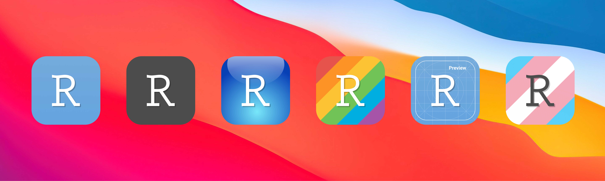
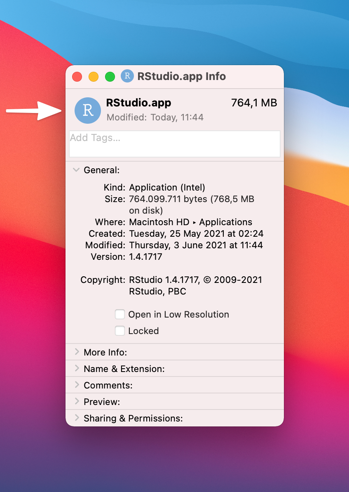

# Alternative Icons for RStudio

These are set of alternative icons for RStudio specifically designed to fit macOS Big Sur aesthetic. Their main features are rounded bezels, mild drop shodows and some gradients. I have tried to keep them as close as possible to the original icons. In addition to the original icons and their variants listed [here](https://www.rstudio.com/about/logos/), I have designed three extra icons, the Pride, the Trans, and the Preview icons.

Besides the Big Sur icons, you can find a circular and rectangular variants of the icons as well. These might be more suitable for Windows or Linux systems.

## Usage

### macOS

1. Navigate to the *Applications* Folder
2. Right click on the *RStudio.app* and select *Get Info*
	- Doing so will open a new form that shows some general information about the *RStudio.app* file.
4. Here, select the icon you prefer, and drag-and-drop it over the RStudio logo on **top right** of the Info window.

Note that this is a temporary solution, and after reinstalling or updating the RStudio, you may need to overwrite your icon again.

### Windows

While I specifically designed these icons for macOS, you can still use them on Windows too. Since I do not have a Windows machine and it's been a while that I have worked with them, I cannot tell you how to change your icon. Please Google it! 🔎 

I know this much that you need the `.ICO` files, and you can find them in the `Icons/Windows` folder.

### On Linux

On Linux, you really need to Google it! It is different from distro to distro. As far as I know, on Linux you need to use the PNG file. You can find them in the `src/PNG` folder. Good luck! 🍀

## Contribution

Please let me know if you have noticed any issues with any of the icons. 

## TODO

- [ ] If you happen to know a nice way of incorporating the 

## Support

You can always support my project through GitHub Sponsorship project. Find the 💖 button in this page, and either sponsor me monthly, or make a one-time donation. I would really appriciate it! 🙂 🙏🏼